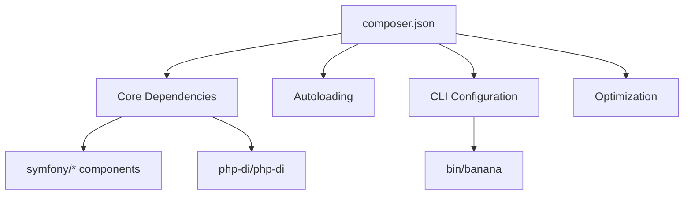
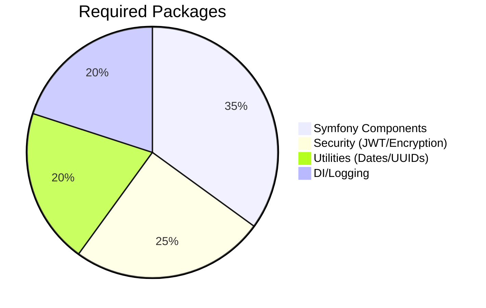
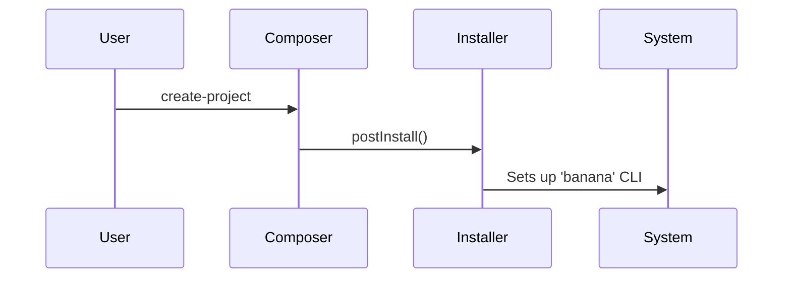
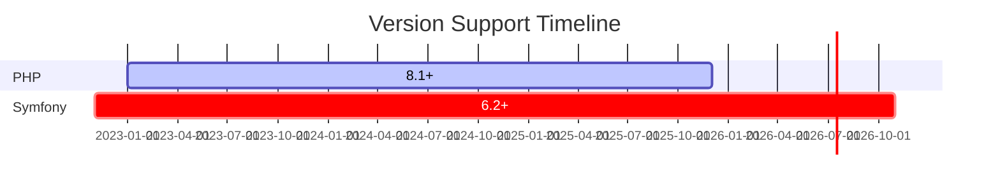

# 🍌 BananaPHP Composer Reference
*`composer.json` Architecture Guide*  
 



## 🛠️ Configuration Overview
### 📦 Package Definition
```json
{
  "name": "meyoramu/banana-php",
  "type": "project",
  "license": "MIT"
}
```
- **Purpose**: Identifies the package and its open-source license  
- **Best Practice**: Matches [PHP-FIG package naming](https://www.php-fig.org/)

---

### 🔗 Dependency Graph


---

## 🧩 Key Sections

### 1. Core Requirements (`require`)
```json
"require": {
  "php": "^8.1",
  "symfony/console": "^7.2",
  "php-di/php-di": "^7.0"
}
```
| Package | Purpose | Color Code |
|---------|---------|------------|
| `symfony/*` | Framework infrastructure |  `#0d6efd` |
| `php-di/*` | Dependency injection |  `#20c997` |

---

### 2. CLI Configuration
```json
"bin": ["banana"],
"scripts": {
  "post-create-project-cmd": [
    "BananaPHP\\Installer::postInstall"
  ]
}
```
🔄 **Workflow**:  


---

## 🎨 Color Standards
| Section | Hex Color | Usage |
|---------|----------|-------|
| **Critical** | `#dc3545` | Required PHP/extensions |
| **Framework** | `#0d6efd` | Symfony components |
| **Utilities** | `#20c997` | Helper packages |
| **Dev** | `#6f42c1` | Development tools |

---

## 📊 Version Policy


---

## Best Practices Checklist
- [x] PSR-4 autoloading compliant
- [x] `bin-dir` explicitly set
- [x] Separate `require-dev` for tooling
- [x] License declared
- [x] Stability constraints defined

[🔗 Back to Main README](../README.md)