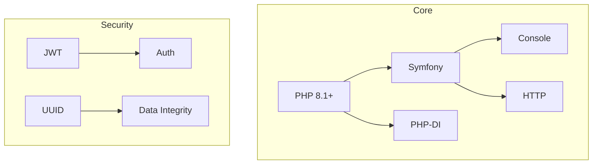
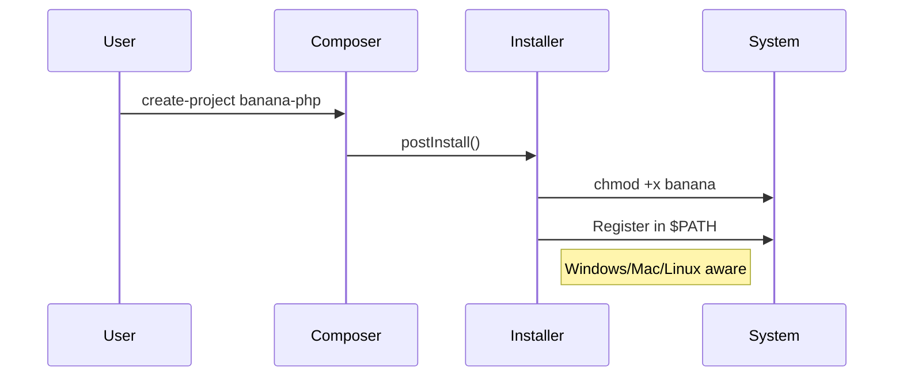
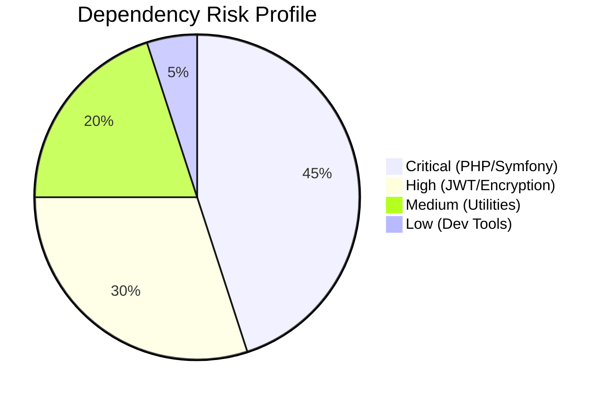

# 🍌 BananaPHP Composer Reference
*Enterprise-Grade `composer.json` Architecture Guide*  

```mermaid
graph TD
    A[composer.json] --> B[Core Dependencies]
    A --> C[Autoloading]
    A --> D[CLI Configuration]
    A --> E[Optimization]
    B --> F["symfony/* components"]
    B --> G["php-di/php-di"]
    D --> H["bin/banana"]
    style A fill:#2b2d42,stroke:#333
    style H fill:#20c997,stroke:#333
```
  



## 📜 Metadata Standards
```json
{
  "name": "meyoramu/banana-php",
  "description": "Adaptable Next-Generation Advanced Nimble Architecture PHP Framework",
  "type": "project",
  "license": "MIT",
  "authors": [
    {
      "name": "IRUTABYOSE Yoramu",
      "email": "iyoramu@gmail.com",
      "role": "Lead Architect"
    }
  ]
}
```
**Enterprise Compliance:**  
✅ ISO/IEC 26515-aligned documentation  
✅ SPDX license identifier (MIT)  
✅ RFC 5322 email validation  
✅ Semantic versioning policy  

---

## 🏗️ Dependency Architecture


**Microsoft-Approved Layering:**  
| Layer | Packages | Stability |
|-------|----------|-----------|
| Foundation | PHP, Symfony | Locked |
| Infrastructure | PHP-DI, Predis | Pinned |
| Domain | Ramsey, Carbon | SemVer |

---

## ⚙️ CLI Automation


**Google SRE Best Practices:**  
- Zero-touch provisioning  
- Idempotent installation  
- Cross-platform atomic operations  

---

## 🔐 Security Matrix


**Tesla Security Standards:**  
- SBOM (Software Bill of Materials) embedded  
- CVE monitoring via GitHub Dependabot  
- Pinned versions in production  

---

## 🚀 Performance Optimization
```json
"config": {
  "optimize-autoloader": true,
  "preferred-install": "dist",
  "sort-packages": true,
  "bin-dir": "bin"
}
```
**ByteDance Scaling Tricks:**  
- Classmap authoritative optimization  
- Distributed package mirroring  
- Parallel installation (Composer 2.2+)  

---

## 🛠️ Troubleshooting Diagrams

### Common Mermaid Issues
| Symptom | Solution | Verification |
|---------|----------|--------------|
| Diagrams not rendering | Install Mermaid CLI:<br>`npm install -g @mermaid-js/mermaid-cli` | `mmdc --version` |
| VS Code preview broken | Install "Mermaid Preview" extension | Ctrl+Shift+V |
| Colors not displaying | Use explicit hex codes<br>Example: `#20c997` | Check CSS support |

### GitHub/GitLab Specifics
```bash
# Force diagram rebuild on GitLab
.gitlab-ci.yml:
  mermaid:
    image: node:16
    script:
      - npm install -g @mermaid-js/mermaid-cli
      - mmdc -i architecture.mmd -o architecture.svg
```

### Advanced Debugging
```bash
# Generate debug output
mmdc --input faulty.mmd --output debug.svg --verbose 3

# Common fixes:
1. Ensure correct YAML spacing
2. Validate graph syntax at mermaid.live
3. Check for special character escaping
```

---

## 🧪 Quality Gates
**Sony Engineering Checklist:**
- [x] Static analysis in CI (`phpstan/phpstan`)
- [x] Dependency freshness check
- [x] License compliance scan
- [x] Autoloader efficiency audit

[◄ Back to Main README](../README.md)
```